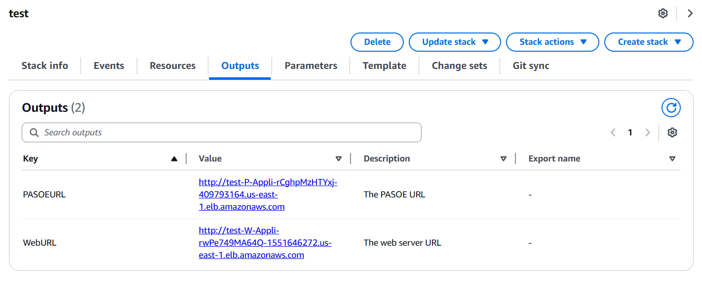

# OpenEdge deployed using AWS CloudFormation Templates

## How to Use This Repository

Welcome to the OpenEdge AWS AMI Deployment using CloudFormation templates repository for Progress OpenEdge!  
This guide will help you get started with using this repository to deploy the solution on AWS.

---

## Pre-requisites

Before using this repository, ensure you have completed the following:

1. **AWS Account**  
   You must have an active AWS account with sufficient permissions to deploy AWS CloudFormation stacks and related resources.

2. **Linux Environment or Cloud Shell**  
   You need access to a Linux environment or a cloud shell (such as AWS CloudShell) to run the deployment scripts and related commands. Most commands and scripts in this guide are intended for Linux shells (bash). 

3. **AWS CLI**  
   Install and configure the [AWS CLI](https://docs.aws.amazon.com/cli/latest/userguide/getting-started-install.html) with credentials for your account.

4. **Git**  
   Install [Git](https://git-scm.com/downloads) to clone and manage the repository.

5. **Marketplace AMI Subscription**  
   Subscribe to the required AMIs in AWS Marketplace as described in the [pre-deployment steps](docs/deployment_guide/partner_editable/pre_deployment.adoc).

6. **Valid Progress License file (`progress.cfg`)**  
   This file is needed in the automated deployment process using CloudFormation.

7. **AWS Key Pair**  
   You must have an existing AWS EC2 Key Pair in the region where you plan to deploy the solution.  
   This key pair is required to access the EC2 instances created by the CloudFormation stack.
   - To create a key pair, follow the [AWS documentation](https://docs.aws.amazon.com/AWSEC2/latest/UserGuide/create-key-pairs.html).
   - Save the private key (`.pem` file) securely, as you will need it for SSH access.

8. **S3 Buckets**  
   Ideally, you need two Amazon S3 buckets:

   - **Public Bucket:**  
     Used to store your license and application files. Ensure the bucket policy restricts access to only trusted AWS principals.

   - **Private Bucket:**  
     Used to store any custom scripts, templates, or application files required during deployment.

   **Create the buckets in the AWS region where you will deploy the solution.**  
   You can create S3 buckets using the AWS Console or CLI:

   ```sh
   aws s3 mb s3://your-public-bucket-name
   aws s3 mb s3://your-private-bucket-name
   ```

   Replace `your-public-bucket-name` and `your-private-bucket-name` with unique bucket names.

---

Make sure you have the names of your key pair and both S3 buckets ready before starting.

---

## Getting Started

1. **Clone the Repository**
   ```sh
   git clone --recurse-submodules https://github.bedford.progress.com/openedge/openedge-cloud-templates-aws.git
   cd openedge-cloud-templates-aws
   ```

2. **Switch to the Required OpenEdge Release Branch**  
   After cloning the repository, switch to the branch that matches your desired OpenEdge release (for example, `release-12.2.x` or `release-12.8.x`):

   ```sh
   git checkout release-12.8.x   # or release-12.2.x, etc.
   ```
3. **Prepare Application Packages and progress.cfg**  
   You can either create your own deployment packages (such as `db.tar.gz`, `pas.tar.gz`, and `web.tar.gz`) following the official guide "Creating Application Packages to Deploy Using OpenEdge on AWS" (https://community.progress.com/s/article/OpenEdge-AWS-Quick-Start-Example), or use the sample deployment packages provided in the `deploy/cfn/` directory of this repository.  
   
   If you use the provided deployment packages, you must update them with your own `progress.cfg` file. You can do this by running the `scripts/update_tar_with_license.sh` script:
   ```sh
   ./scripts/update_tar_with_license.sh <path-to-tar.gz> <path-to-progress.cfg>
   ```
   Run this for both `db.tar.gz`, `pas.tar.gz` packages.
   
   Ensure you use the correct `progress.cfg` file that matches your OpenEdge version. For example, if you check out the `release-12.8.x` branch, use the `progress.cfg` specific to OpenEdge version 12.8. The PDF guide provides step-by-step details for packaging and placement.

4. **Deploy the Solution**  
   Follow the below instructions to launch the solution using AWS CloudFormation.

   To deploy the solution, you now provide specific parameters in a configuration file (`deployment.conf`). The main required parameters are:

   - **PublicBucket:** Name of your public S3 bucket (for templates and submodules)
   - **PrivateBucket:** Name of your private S3 bucket (for license and application files)
   - **KeyPairName:** Name of your AWS EC2 key pair
   - **EmailAddress:** Email address for notifications or stack alerts
   - **DeployBucketRegion:** AWS region for your private bucket (default: us-east-1)
   - **DBDeployPackage:** Database deployment package file name (default: db.tar.gz)
   - **PASOEDeployPackage:** PASOE deployment package file name (default: pas.tar.gz)
   - **WebDeployPackage:** Web deployment package file name (default: web.tar.gz)
   - **AvailabilityZones:** Comma-separated list of availability zones (default: 'us-east-1a,us-east-1b')

   For simplicity, default values are provided for these parameters in the sample `deployment.conf`. You can update them based on your requirements.


   **Steps:**

   1. Edit the `deployment.conf` file in the root of the repository with the following content:
      ```conf
      PublicBucket=your-public-bucket-name
      PrivateBucket=your-private-bucket-name
      KeyPairName=your-keypair-name (without .pem extension)
      EmailAddress=your-email@example.com
      DeployBucketRegion=us-east-1
      DBDeployPackage=db.tar.gz
      PASOEDeployPackage=pas.tar.gz
      WebDeployPackage=web.tar.gz
      AvailabilityZones=us-east-1a,us-east-1b
      ```
   2. Save the file.
   3. Run the script to start the deployment:
      ```sh
      ./scripts/create_deployment.sh [stack-name] #stack-name is an optional parameter
      ```

   Make sure all pre-requisites are fulfilled and the parameters in `deployment.conf` are set correctly before running the deployment script.

   Now you can go to AWS CloudFormation page in your account and see the resources are getting created properly.
   Example: https://us-east-1.console.aws.amazon.com/cloudformation/home?region=us-east-1#/stacks?

   Once stack creation is successful, you can go to "Outputs" tab and then click on WebURL, which will take you to the web application. Here is a sample screenshot:

   
